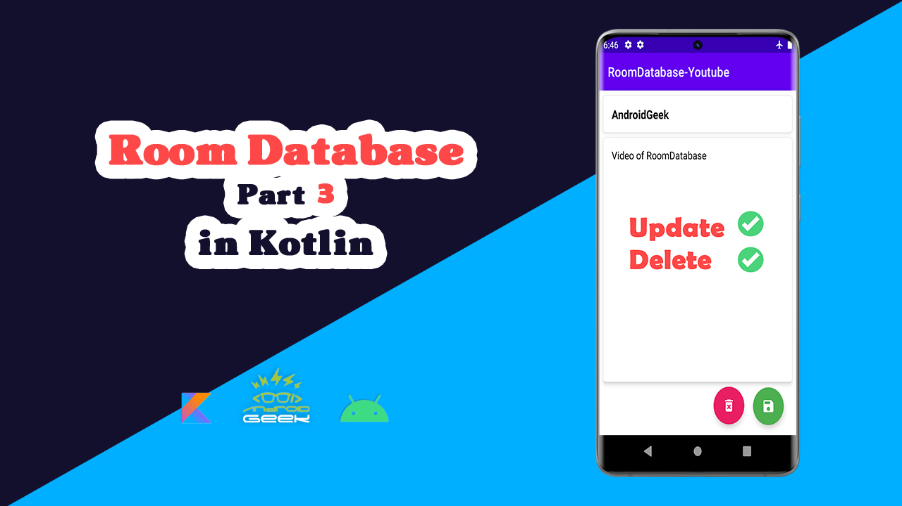

## RoomDatabase Tutorial 

||||
|--|--|--|
|**Part1 Video**|**Part2 Video**|**Part3 Video**|
||||

 

## Flow of RoomDB

 

## Medium Articles 

- [Link1](https://medium.com/@ezatpanah/room-database-in-kotlin-beginner-in-depth-guide-1-91831b69d06b) 

- [Link2](https://medium.com/@ezatpanah/room-database-in-kotlin-beginner-in-depth-guide-2-f52d16db8f5e)

- [Link3](https://medium.com/@ezatpanah/room-database-in-kotlin-beginner-in-depth-guide-3-ddc6c25eab8f)

- Join my [Medium](https://medium.com/@ezatpanah/membership) to read thousands of valuable stories ✨

## Scope of Improvements

- Instead of creating multiple activities, try using Fragments.
- Use MVVM/MVI Architecture for this project.
- Use LiveData.
- Add a Share Option to share the notes.
- Add a Search option to search the existing notes.
- UI Improvements.
